# Live Demo Guide: 20-Minute Job Search Automation Presentation

Use this timeline, notes, and visual guides to structure your live presentation.

---

## ⏱️ Presentation Timeline Breakdown

```mermaid
gantt
    title 20-Minute Presentation Agenda
    dateFormat  m
    axisFormat %M
    
    LinkedIn Profile Optimization    :active, 0, 3m
    Terminal Agent Skills Live Demo  :crit, 3, 10m
    Autofill (Simplify) Integration  : 10, 13m
    Web Prompt Templates (No-CLI)    : 13, 16m
    Recruiter Sourcing (Apollo.io)   : 16, 20m
```

---

## 1. LinkedIn Profile Optimization (0:00 - 3:00)
**Key Message**: *Recruiters source directly on LinkedIn using keyword indices. If your profile isn't optimized, you are invisible.*

* **The Headline Hack**: Explain why standard headlines are a wasted opportunity. 
  * Show the formula: `Title | Tech Keywords | Metric-Driven Accomplishment`.
* **The "About" Blueprint**: Pitch yourself in 3 clean segments: Elevator Pitch → 3 Bullet Accomplishments → Tech Stack keywords block.
* **Algorithm Hacks**: 
  * Turn on "Open to Work" (Recruiter Only mode).
  * Pin your top 3 target skills (recruiters filter searches by "Endorsed Skills").
  * Claim a custom short URL.
* **Skill Reference**: Point the audience to your repo's `/job-linkedin` skill block.

---

## 2. Live Demo of E2E Skills Package (3:00 - 10:00)
**Key Message**: *Watch how we automate database discovery, role extraction, LLM tailoring, and browser auto-fill locally, keyless, in under 2 minutes.*

* **Dashboard Start**: Open the terminal agent and run `/job`. Point out the clean state.
* **Interactive Chat Build**: Run `/job build`. Answer 2 conversational questions to show the Google STAR/XYZ formula bullet refinement live in the terminal.
* **Target Board Scan**: Run `/job discover` then `/job scan`. Explain that Greenhouse and Lever APIs are queried in parallel to fetch open positions and match compatibility scores.
* **Subprocess Tailoring**: Run `/job resume <URL>`. Show the Tectonic XeLaTeX compilation console log. Open the output PDF (`open ~/.job-search/output/resume_stripe.pdf`) showing the custom compiled copy.
* **Cover Letter Drafting**: Run `/job cover <URL>` to compile the matching PDF.

---

## 3. Chrome Autofill Integration (Simplify vs. Content) (10:00 - 13:00)
**Key Message**: *Autofill extensions like Simplify automate forms, while our tool automates content.*

* **Autofill (Simplify)**: Excellent for filling static inputs (Name, Phone, Veteran Status, Work History).
* **The Synergy**: 
  1. Our tool scans the board and executes LLM subprocess tailoring to compile a highly optimized XeLaTeX PDF resume matching the JD keywords.
  2. The Playwright auto-filler (or Chrome extensions like Simplify) loads this tailored PDF and auto-fills the portal inputs.
  3. They work hand-in-hand to ensure both form-filling speed AND context-driven tailoring quality.

---

## 4. Helper Prompts for Web UIs (No-CLI Users) (13:00 - 16:00)
**Key Message**: *You don't need a terminal CLI to leverage this pipeline. You can use standard LLM web assistants (ChatGPT, Gemini, Claude, Copilot) with templates.*

* Show the **[WEB_PROMPTS.md](file:///Users/prateeklalwani/job-search-ai/docs/WEB_PROMPTS.md)** guide in your repository.
* **Explain**: Show how copy-pasting the *Resume Experience Tailoring* prompt tells standard web assistants to match their CV bullets to a JD, keeping it safe, clean, and metrics-driven without terminal setups.

---

## 5. Apollo.io Recruiter Extraction & Outbound (16:00 - 20:00)
**Key Message**: *Applying gets you in the pool; cold messaging recruiters gets you the call. Use Apollo.io to bypass the gatekeeper.*

* **Apollo.io Chrome Extension**:
  * Show how to open a target company's LinkedIn Page (e.g. Stripe).
  * Use the Apollo.io sidebar to filter employees by "Job Title = Recruiter / Engineering Manager".
  * Click "Access Email" to instantly retrieve their direct company email address and verified phone number.
* **Cold Outreach**:
  * Show the outbound templates inside **[job-linkedin.md](file:///Users/prateeklalwani/job-search-ai/skills/job-linkedin.md)**.
  * Send a highly tailored note (referencing that you applied, pointing out your matching achievements, and attaching the customized resume PDF compiled by your CLI tool).
